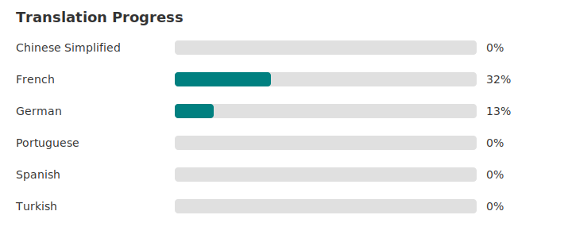

# Localisation

HydroTracker is translated by volunteers through [Crowdin](https://crowdin.com/project/hydrotracker).

## Translation Progress

<!-- TRANSLATION_PROGRESS_START -->
*Last updated: 2026-07-19 11:35 UTC*

<!-- TRANSLATION_PROGRESS_END -->

## Supported Languages

<!-- SUPPORTED_LANGUAGES_START -->
HydroTracker currently ships with English as the source language. The following target languages are active on Crowdin:

- English (source)
<!-- SUPPORTED_LANGUAGES_END -->

## Requesting a New Language

If you would like to translate HydroTracker into a language that is not listed, please reply to the [Help translate HydroTracker](https://github.com/Econ01/HydroTracker/discussions/54) discussion. Only project managers can add new languages in Crowdin.

## Translators

| Language | Contributors |
|----------|--------------|
| Turkish | Ali Cem Çakmak |
